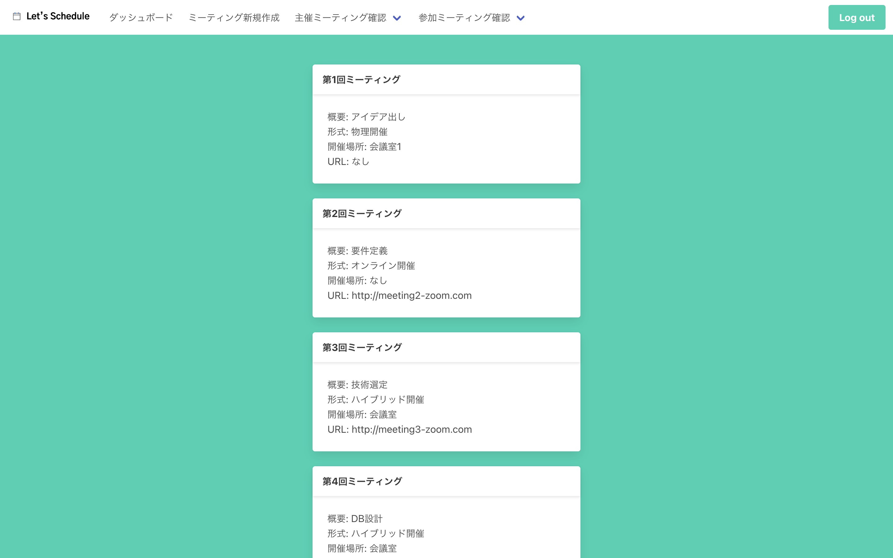

# 日程調整ツール要件定義書

1. [プロジェクト概要](#プロジェクト概要)
   1. [背景と目的](#背景と目的)
   2. [前提条件](#前提条件)
   3. [制約条件](#制約条件)
2. [機能要件](#機能要件)
   1. [ユーザー管理](#ユーザー管理)
   2. [日程調整](#日程調整)
   3. [カレンダー連携](#カレンダー連携)
3. [非機能要件](#非機能要件)
   1. [パフォーマンス](#パフォーマンス)
   2. [可用性](#可用性)
   3. [拡張性](#拡張性)
   4. [保守性](#保守性)
4. [セキュリティ要件](#セキュリティ要件)
   1. [データ保護](#データ保護)
   2. [脆弱性対策](#脆弱性対策)
5. [ユーザーインターフェース設計](#ユーザーインターフェース設計)
   1. [レイアウト](#レイアウト)
   2. [ページ遷移図](#ページ遷移図)
6. [API設計](#api設計)
   1. [Userオブジェクト](#userオブジェクト)
   2. [Meetingオブジェクト](#meetingオブジェクト)
   3. [CandidateTimeオブジェクト](#candidatetimeオブジェクト)
   4. [Participantオブジェクト](#participantオブジェクト)
   5. [共通設定](#共通設定)
   6. [ユーザー関連API](#ユーザー関連api)
   7. [ミーティング関連API](#ミーティング関連api)
   8. [候補日時関連API](#候補日時関連api)
   9. [参加者関連API](#参加者関連api)
7. [テーブル設計](#テーブル設計)
   1. [前提](#前提)
   2. [Usersテーブル](#usersテーブル)
   3. [Meetingsテーブル](#meetingsテーブル)
   4. [Participantテーブル](#participantテーブル)
   5. [CandidateTimeテーブル](#candidatetimeテーブル)
8. [技術選定](#技術選定)
   1. [フロントエンド](#フロントエンド)
   2. [バックエンド](#バックエンド)
   3. [データベース](#データベース)
   4. [インフラ](#インフラ)
9. [運用・保守要件](#運用保守要件)
   1. [インフラ構成図](#インフラ構成図)
   2. [ログ管理](#ログ管理)


## プロジェクト概要

### 背景と目的

日程調整はビジネスにおいて重要なプロセスであり、効率的に行うためには適切なツールが必要である。本プロジェクトでは、ユーザーが簡単かつ迅速にミーティングのスケジュールを調整できるアプリケーションを開発することを目的としている。

### 前提条件

- インターネット接続が必須
- ユーザーはメールアドレスを持っていること
- 対象デバイスはPC、タブレット、スマートフォンとする

### 制約条件

- プライバシー保護のため、データは暗号化して保存する
- サービスの稼働率は99.9%以上を目指す

## 機能要件

### ユーザー管理

- ユーザー登録
- ログイン / ログアウト

### 日程調整

- 新規ミーティング作成
- 候補日時の編集

### カレンダー連携

- Googleカレンダー連携
- Outlookカレンダー連携
- カレンダーのエクスポート

## 非機能要件

### パフォーマンス

- サーバー応答時間は200ms以内
- 高トラフィック時もスムーズに動作する

### 可用性

- AWS EC2を2台用いた冗長構成

### 拡張性

- ユーザー数の増加に対応可能
- 新機能追加の柔軟性

### 保守性

- コードの可読性を保つ
- 自動テストの導入

## セキュリティ要件

### データ保護

- データの暗号化
- 定期的なセキュリティチェック

### 脆弱性対策

- ペネトレーションテストの実施

## ユーザーインターフェース設計

### レイアウト

- ユーザーフレンドリーなインターフェース
- レスポンシブデザイン対応
- PC・スマホ・タブレットのスクリーンサイズに応じた画面サイズ

### ページ遷移図





## API設計

### Userオブジェクト

| 変数名 | 型 | 説明 | 
| ---- | ---- | ---- |
| id | int | ユーザーID |
| user_name | string |  ユーザー名 | 
| email_address | string | メールアドレス | 
| password | string | パスワード | 
| is_admin | bool | 管理者かどうか | 
| can_login | bool | ログイン可能か | 
| created_at | datetime | 登録日時 | 
| updated_at | datetime | 更新日時 | 

### Meetingオブジェクト

| 変数名 | 型 | 説明 | 
| ---- | ---- | ---- |
| id | int | ミーティングID | 
| title | string | ミーティング名 | 
| description | text | 概要 | 
| type | string | 形式 | 
| place | string | 集合場所 | 
| url | string | ミーティングURL | 
| all_participants_responded | bool | 全員が回答したか | 
| is_confirmed | bool | 確定したか | 
| start_time | datetime | 開始日時 | 
| end_time | datetime | 終了日時 | 
| created_at | datetime | 登録日時 | 
| updated_at | datetime | 更新日時 | 

### CandidateTimeオブジェクト

| 変数名 | 型 | 説明 | 
| ---- | ---- | ---- |
| id  | int | ID | 
| user_id | int | ユーザーID | 
| meeting_id | int | ミーティングID |
| start_time | datetime | 開始時間 | 
| end_time | datetime | 終了時間 | 
| created_at | datetime | 登録日時 | 
| updated_at | datetime | 更新日時 | 

### Participantオブジェクト

| 変数名 | 型 | 説明 | 
| ---- | ---- | ---- |
| id  | int | ID | 
| user_id | int | ユーザーID | 
|  meeting_id | int | ミーティングID |
| is_host | bool | 主催者かどうか | 
| has_responded | bool | 回答の有無 | 
| created_at | datetime | 登録日時 | 
| updated_at | datetime | 更新日時 | 


### 共通設定

各APIは次のフォーマットのURLとする

```
https://lets-schedule.net/<エンドポイントのパス>
```

通信プロトコル: HTTPS
APIの種類: REST API
インターフェース: JSON
文字コード: UTF-8

### ユーザー関連API

#### 新規ユーザー作成

エンドポイント POST /YXBpL3NpZ251cA==

リクエストパラメータ

| キー名 | 型 (変数) | 概要 | 備考 |
| -- | -- | -- | -- | 
| id | int | ユーザーID | -- | 
| username | string | ユーザー名 | |
| email_address | string | メールアドレス | |
| password | string | パスワード | |
| is_admin | bool | 管理者かどうか | デフォルトはfalse |
| can_login | bool | ログイン可能かどうか | デフォルトはtrue |


ステータスコード

| コード | 意味 |
| -- | -- | 
| 200 | ユーザー登録成功 |
| 400 | ユーザー登録失敗 |

レスポンスパラメータ

| シチュエーション | キー名 | 型 | 概要 |
| -- | -- | -- | -- | 
| 成功時 | id | int | ユーザーID |
| | username | string | ユーザー名 |
| | email_address | string | メールアドレス |
| | password | string | パスワード |
| | is_admin | bool | 管理者かどうか |
| | can_login | bool | ログイン可能かどうか | 
| 失敗時 | errorMessageList | array\[string\] | エラーメッセージの配列 |

### ミーティング関連API

#### ミーティング新規作成

エンドポイント POST /YXBpL3Jlc3RyaWN0ZWQvbWVldGluZ3MvbmV3

パラメータ

| キー名 | 型 (変数) | 概要 | 
| -- | -- | -- |
| title | string | ミーティング名 |
| description | text | 概要 |
| type | string | 形式 |
| place | string | 集合場所 |
| url | string | ミーティングURL |
| is_confirmed | bool | 日時が決定したかどうか |


ステータスコード

| コード | 意味 |
| -- | -- |
| 200 | ミーティング登録成功 |
| 400 | ミーティング登録失敗 |


レスポンスパラメータ

| シチュエーション | キー名 | 型 | 概要 |
| -- | -- | -- | -- | 
| 成功時 | id | int | ユーザーID |
| | title | string | ミーティング名 |
| |  description | text | 概要 |
| |  type | string | 形式 |
| |  place | string | 集合場所 |
| |  url | string | ミーティングURL |
| |  is_confirmed | bool | 日時が決定したかどうか |
| 失敗時 | errorMessageList | array\[string\] | エラーメッセージの配列 |


#### ミーティング情報取得

エンドポイント GET /YXBpL3Jlc3RyaWN0ZWQvbWVldGluZ3MvdXNlcg==/:user_id

パラメータ

| キー名 | 型 (変数) | 概要 | 
| -- | -- | -- |
| user_id | string | ユーザーID |


ステータスコード

| コード | 意味 |
| -- | -- |
| 200 | ミーティング情報取得成功 |
| 400 | ミーティング情報取得失敗 |


レスポンスパラメータ

| シチュエーション | キー名 | 型 (変数) | 概要 | 
| -- | -- | -- | -- |
| 成功時 | id| string | ミーティングID |
| | title | string | ミーティング名 |
| | description | text | 概要 |
| | type | string | 形式 |
| | meeting_place | string | 集合場所 |
| | meeting_url | string | ミーティングURL |
| | all_participants_responded | bool | 全員から返信があったか |
| | is_confirmed | bool | 日時が決まったか |
| | start_time | datetime | ミーティングの開始日時 |
| | end_time | datetime | ミーティングの終了日時 |
| | hour | float | ミーティングの時間 (h) |
| 失敗時 | error | string | デフォルトは「エラーが発生しました」 |

#### 日時が決定した主催ミーティング情報取得

エンドポイント GET /YXBpL3Jlc3RyaWN0ZWQvbWVldGluZ3MvaG9zdC9jb25maXJtZWQ=/:user_id

パラメータ

| キー名 | 型 (変数) | 概要 | 
| -- | -- | -- |
| user_id | string | ユーザーID |


ステータスコード

| コード | 意味 |
| -- | -- |
| 200 | ミーティング情報取得成功 |
| 400 | ミーティング情報取得失敗 |


レスポンスパラメータ

| シチュエーション | キー名 | 型 (変数) | 概要 | 
| -- | -- | -- | -- |
| 成功時 | meetings | Meeting[] | ミーティング情報の配列 |
| 失敗時 | error | string | デフォルトは「エラーが発生しました」 |


#### 日時が決定していない主催ミーティング情報取得

エンドポイント GET /aYXBpL3Jlc3RyaWN0ZWQvbWVldGluZ3MvaG9zdC9ub3QtY29uZmlybWVk/:user_id

パラメータ

| キー名 | 型 (変数) | 概要 | 
| -- | -- | -- |
| user_id | string | ユーザーID |


ステータスコード

| コード | 意味 |
| -- | -- |
| 200 | ミーティング情報取得成功 |
| 400 | ミーティング情報取得失敗 |


レスポンスパラメータ

| シチュエーション | キー名 | 型 (変数) | 概要 | 
| -- | -- | -- | -- |
| 成功時 | meetings | Meeting[] | ミーティング情報の配列 |
| 失敗時 | error | string | デフォルトは"エラーが発生しました |


#### 返信していない主催ミーティング情報取得

エンドポイント GET /YXBpL3Jlc3RyaWN0ZWQvbWVldGluZ3MvaG9zdC9ub3QtcmVzcG9uZGVk/:user_id

パラメータ

| キー名 | 型 (変数) | 概要 | 
| -- | -- | -- |
| user_id | string | ユーザーID |


ステータスコード

| コード | 意味 |
| -- | -- |
| 200 | ミーティング情報取得成功 |
| 400 | ミーティング情報取得失敗 |


レスポンスパラメータ

| シチュエーション | キー名 | 型 (変数) | 概要 | 
| -- | -- | -- | -- |
| 成功時 | meetings | Meeting[] | ミーティング情報の配列 |
| 失敗時 | error | string | デフォルトは「エラーが発生しました」 |


#### 日時が決定している参加ミーティング情報取得

エンドポイント GET /YXBpL3Jlc3RyaWN0ZWQvbWVldGluZ3MvZ3Vlc3QvY29uZmlybWVk/:user_id

パラメータ

| キー名 | 型 (変数) | 概要 | 
| -- | -- | -- |
| user_id | string | ユーザーID |


ステータスコード

| コード | 意味 |
| -- | -- |
| 200 | ミーティング情報取得成功 |
| 400 | ミーティング情報取得失敗 |


レスポンスパラメータ

| シチュエーション | キー名 | 型 (変数) | 概要 | 
| -- | -- | -- | -- |
| 成功時 | meetings | Meeting[] | ミーティング情報の配列 |
| 失敗時 | error | string | デフォルトは「エラーが発生しました」 |


#### 日時が決定していない参加ミーティング情報取得

エンドポイント GET /YXBpL3Jlc3RyaWN0ZWQvbWVldGluZ3MvZ3Vlc3Qvbm90LWNvbmZpcm1lZA==/:user_id

パラメータ

| キー名 | 型 (変数) | 概要 | 
| -- | -- | -- |
| user_id | string | ユーザーID |


ステータスコード

| コード | 意味 |
| -- | -- |
| 200 | ミーティング情報取得成功 |
| 400 | ミーティング情報取得失敗 |


レスポンスパラメータ

| シチュエーション | キー名 | 型 (変数) | 概要 | 
| -- | -- | -- | -- |
| 成功時 | meetings | Meeting[] | ミーティング情報の配列 |
| 失敗時 | error | string | デフォルトは |


#### 返信していない参加ミーティング情報取得

エンドポイント GET /YXBpL3Jlc3RyaWN0ZWQvbWVldGluZ3MvZ3Vlc3Qvbm90LXJlc3BvbmRlZA===/:user_id

パラメータ

| キー名 | 型 (変数) | 概要 | 
| -- | -- | -- |
| user_id | string | ユーザーID |


ステータスコード

| コード | 意味 |
| -- | -- |
| 200 | ミーティング情報取得成功 |
| 400 | ミーティング情報取得失敗 |


レスポンスパラメータ

| シチュエーション | キー名 | 型 (変数) | 概要 | 
| -- | -- | -- | -- |
| 成功時 | meetings | Meeting[] | ミーティング情報の配列 |
| 失敗時 | error | string | デフォルトは「エラーが発生しました」 |

### 候補日時関連API

#### 候補日時の新規登録

エンドポイントPOST /YXBpL3Jlc3RyaWN0ZWQvY2FuZGlkYXRlX3RpbWVzL25ldw==

リクエストパラメータ

| キー名 | 型 (変数) | 概要 |
| -- | -- | -- |
| candidate_time_list | CandidateTime[] | 候補日時の配列 |


レスポンスパラメータ

| シチュエーション | キー名 | 型 (変数) | 概要 | 
| -- | -- | -- | -- |
| 成功時 | candidate_time | CandidateTime[] | 候補日時の配列 |
| 失敗時 | error | string | デフォルトは「エラーが発生しました」 |


#### 候補日時の取得

エンドポイント GET /YXBpL3Jlc3RyaWN0ZWQvY2FuZGlkYXRlX3RpbWVzL3VzZXI=/:user_id/bWVldGluZw==/:meeting_id

リクエストパラメータ

| キー名 | 型 (変数) | 概要 |
| -- | -- | -- |
| user_id | int | ユーザーID |
| meeting_id | int | ミーティングID |


レスポンスパラメータ

| シチュエーション | キー名 | 型 (変数) | 概要 | 
| -- | -- | -- | -- |
| 成功時 | candidate_time | CandidateTime | 候補日時の配列 |
| 失敗時 | error | string | デフォルトは「エラーが発生しました」 |


#### 候補日時の編集

エンドポイント PUT /YXBpL3Jlc3RyaWN0ZWQvY2FuZGlkYXRlX3RpbWVzL3VzZXI=/:user_id/bWVldGluZw==/:meeting_id

リクエストパラメータ

| キー名 | 型 (変数) | 概要 |
| -- | -- | -- |
| user_id | int | ユーザーID |
| meeting_id | int | ミーティングID |


レスポンスパラメータ

| シチュエーション | キー名 | 型 (変数) | 概要 | 
| -- | -- | -- | -- |
| 成功時 | candidate_time | CandidateTime[] | 候補日時の配列 |
| 失敗時 | error | string | デフォルトは「エラーが発生しました」 |


### 参加者関連API 

#### 参加者の新規登録

エンドポイントPOST /YXBpL3Jlc3RyaWN0ZWQvcGFydGljaXBhbnRzL25ldw==

リクエストパラメータ

| キー名 | 型 (変数) | 概要 |
| -- | -- | -- |
| participants | Participant[] | 候補日時の配列 |


レスポンスパラメータ

| シチュエーション | キー名 | 型 (変数) | 概要 | 
| -- | -- | -- | -- |
| 成功時 | participants | Participant[] | 候補日時の配列 |
| 失敗時 | error | string | デフォルトは「エラーが発生しました」 |


#### 参加者の取得

エンドポイント GET /YXBpL3Jlc3RyaWN0ZWQvcGFydGljaXBhbnRz/:meeting_id

リクエストパラメータ

| キー名 | 型 (変数) | 概要 |
| -- | -- | -- |
| meeting_id | int | ミーティングID |


レスポンスパラメータ

| シチュエーション | キー名 | 型 (変数) | 概要 | 
| -- | -- | -- | -- |
| 成功時 | participants | Participant[] | 候補日時の配列 |
| 失敗時 | error | string | デフォルトは「エラーが発生しました」 |

#### 参加者の編集

エンドポイント PUT /YXBpL3Jlc3RyaWN0ZWQvcGFydGljaXBhbnRzL21lZXRpbmc=/:meeting_id

リクエストパラメータ

| キー名 | 型 (変数) | 概要 |
| -- | -- | -- |
| meeting_id | int | ミーティングID |


レスポンスパラメータ

| シチュエーション | キー名 | 型 (変数) | 概要 | 
| -- | -- | -- | -- |
| 成功時 | participants | Participant[] | 参加者の配列 |
| 失敗時 | error | string | デフォルトは「エラーが発生しました」 |


## テーブル設計

### 前提

- 文字コードはUTF-8を用いる
- タイムゾーンはAsia/Tokyoを用いる
- sys.columnsは使用しない

### Usersテーブル

| 項目名 (日本語) | 項目名 (変数) | 型 | 備考 | 
| ---- | ---- | ---- | ---- |
| ID | id | bigint(11) | not null auto increment |
| ユーザー名 | user_name | varchar(191) | not null |
| メールアドレス | email_address | varchar(191) | not null |
| パスワード | password | varchar(191) | not null |
| 管理者かどうか | is_admin | boolean | not null |
| ログイン可能か | can_login | boolean | not null |
| 登録日時 | created_at | datetime | not null,  default current_datetime |
| 更新日時 | updated_at | datetime | not null,  default current_datetime on update current_datetime |

| キー名 | キー | 
| ---- | ---- | 
| プライマリーキー | id | 

### Meetingsテーブル

| 項目名 (日本語) | 項目名 (変数) | 型 | 備考 | 
| ---- | ---- | ---- | ---- |
| ID | id | bigint(11) | not null auto increment |
| ミーティング名 | title | varchar(191) | not null |
| 概要 | description | text | not null |
| 形式 | type | varchar(191) | 現地 or オンライン |
| 集合場所 | place | varchar(191) | |
| ミーティングURL | url | varchar(191) | |
| 全員が回答したか | all_participants_responded | boolean | not null |
| 確定したか | is_confirmed | boolean | not null |
| 開始日時 | start_time | datetime | not null |
| 終了日時 | end_time | datetime | not null |
| ミーティング時間(分) | minutes | int | not null |
| 登録日時 | created_at | datetime | not null default current_datetime |
| 更新日時 | updated_at | datetime | not null default current_datetime on update current_datetime |

| キー名 | キー | 
| ---- | ---- | 
| プライマリーキー | id | 

### Participantテーブル

| 項目名 (日本語) | 項目名 (変数) | 型 | 備考 | 
| ---- | ---- | ---- | ---- |
| ID | id  | bigint(11) | not null auto increment |
| ユーザーID | user_id | bigint(11) | not null |
| ミーティングID | meeting_id | bigint(11) | not null |
| 主催者かどうか | is_host | boolean | not null |
| 回答の有無 | has_responded | boolean | not null |
| 登録日時 | created_at | datetime | not null default current_datetime |
| 更新日時 | updated_at | datetime | not null default current_datetime on update current_datetime |

| キー名 | キー | テーブル | 
| ---- | ---- | ---- |
| プライマリーキー | id | |
| 外部キー | meeting_id | Meeting |

### CandidateTimeテーブル

| 項目名 (日本語) | 項目名 (変数) | 型 | 備考 | 
| ---- | ---- | ---- | ---- |
| ID | id  | bigint(11) | not null auto increment |
| ユーザーID | user_id | bigint(11) | not null |
| ミーティングID | meeting_id | bigint(11) | not null |
| 開始時間 | start_time | datetime | not null |
| 終了時間 | end_time | datetime | not null |
| 登録日時 | created_at | datetime | not null default current_datetime |
| 更新日時 | updated_at | datetime | not null default current_datetime on update current_datetime |

| キー名 | キー | テーブル | 
| ---- | ---- | ---- | 
| プライマリーキー | id | |
| 外部キー | user_id | User |
| | meeting_id | Meeting |

## 技術選定

### フロントエンド

#### 使用技術

本アプリケーションのフロントエンドには、JavaScriptのフロントエンドアプリケーションであるVue3、中でもOption APIを採用する。

#### Vue.jsの選定理由

Vue.jsを採用する背景には、可読性の高さが挙げられる。開発者は実務でReactとVue両方の経験があるが、ReactはJSXという独自の構文拡張が用いられる一方、VueはHTML・CSS・JavaScriptがそのまま書けるので、フロントエンドの実装に不慣れな開発者でも高い生産性が担保できる。

Vue3の使用APIに関しても、独自の構文拡張を使用するComposition APIではなく、HTML・CSS・JavaScriptの実装箇所を分離できるOption APIを選定した。

### バックエンド

#### 使用技術

本アプリケーションのバックエンドには、プログラミング言語はGolang、webフレームワークはEchoを採用する。

#### Golang (Echo)の選定理由

Golangを選定した理由として、型安全性が高い点が挙げられる。
開発者が実務で使用経験がある言語としてPython、Ruby、Golangがある。3つとも可読性の高い中で、静的型付けでランタイムエラーを未然に防止できるGolangを選定した。

Golangのwebフレームワークの中でEchoを選定した理由として、エコシステムの豊富さが挙げられる。
多くの公式ミドルウェアが提供されており、それらの使用法も公式ホームページで解説されている。

### データベース

#### 使用技術

本アプリケーションのデータベースにはMariaDBを採用する。

#### MariaDBの選定理由

MariaDBの選定理由として、機能のシンプルさとARM対応が挙げられる。本アプリケーションではPostgreSQL独自の機能は使用しないので、MySQLやそれに互換性のあるRDBMSの使用を検討した。
その中でMariaDBのDocker imageはARM64に対応しており、開発者が使用するApple SiliconのMacbookでも動作することから、MariaDBを選定した。

### インフラ

#### 使用技術

本アプリケーションの運用にはAWSが提供するEC2を採用する。

#### AWS (EC2)の選定理由

LambdaやECS・EKSなどのマネージドサービスとは違い、EC2インスタンスはVPC（Virtual Private Cloud）内で動作するため、ネットワーキングとセキュリティを細かく設定できる点が挙げられる。

## 運用・保守要件

### インフラ構成図


#### ネットワーク
  - VPC 20.0.0.0/16 (ap-northeast-1)
    - subnet1 20.0.1.0/24 (ap-northeast-1a)
    - subnet2 20.0.2.0/24 (ap-northeast-1b)

####  セキュリティグループ

##### インバウンドルール

| プロトコル | ポート範囲 | ソース | 説明 | 
| ---- | ---- | ---- | ---- |
| TCP | 8443 | 0.0.0.0/0 | カスタムHTTPSポート (公開アクセス)|

##### アウトバウンドルール

| プロトコル | ポート範囲 | ソース | 説明 | 
| ---- | ---- | ---- | ---- |
| All | All | 0.0.0.0/0 | |

### ログ管理

ホストVM
- アクセスログ: nginxのHTTPリクエストログ
- エラーログ: nginxのエラーログ
- アップストリームログ: webサーバーへのアクセスログ
- レスポンスログ: nginxのHTTPレスポンスログ

Webサーバー (ゲストVM)
- アクセスログ: nginxのアクセスログ
- エラーログ: nginxのエラーログ

APIサーバー (ゲストVM)
- アクセスログ: HTTPリクエストのログ
- レスポンスログ: HTTPレスポンスのログ
- クエリログ: DBで発行したクエリのログ

DBサーバー (ゲストVM)
- アクセスログ: DBサーバーのアクセスログ

