# 日程調整webアプリケーションLet's schedule要件定義書

1. [概要](#概要)
   1. [前提条件](#前提条件)
   2. [制約条件](#制約条件)
2. [機能要件](#機能要件)
   1. [基本機能](#基本機能)
      1. [ユーザー管理](#ユーザー管理)
      2. [日程調整](#日程調整)
      3. [カレンダー連携](#カレンダー連携)
   2. [フロントエンド](#フロントエンド)
      1. [UI](#ui)
      2. [ページ遷移図](#ページ遷移図)
   3. [バックエンド](#バックエンド)
      1. [オブジェクト定義](#オブジェクト定義)
      2. [API定義](#api定義)
   4. [DB](#db)
      1. [前提](#前提)
      2. [Usersテーブル](#usersテーブル)
      3. [Meetingsテーブル](#meetingsテーブル)
      4. [Participantテーブル](#participantテーブル)
      5. [CandidateTimeテーブル](#candidatetimeテーブル)
      6. [キー一覧](#キー一覧)
3. [非機能要件](#非機能要件)
   1. [可用性](#可用性)
      1. [SLA](#sla)
   2. [パフォーマンス](#パフォーマンス)
      1. [同時接続数](#同時接続数)
   3. [セキュリティ](#セキュリティ)
      1. [証明書](#証明書)
      2. [アクセス制御](#アクセス制御)
   4. [可観測性](#可観測性)
      1. [ホストVM](#ホストvm)
      2. [Webサーバー](#webサーバー)
      3. [APIサーバー](#apiサーバー)
      4. [DBサーバー](#dbサーバー)
   5. [保守性](#保守性)
      1. [インフラ構成図](#インフラ構成図)
      2. [ネットワーク構成](#ネットワーク構成)
      3. [セキュリティグループ](#セキュリティグループ)
4. [使用技術](#使用技術)
   1. [フロントエンド](#フロントエンド-1)
   2. [バックエンド](#バックエンド-1)
   3. [DB](#db-1)
   4. [インフラ](#インフラ)
5. [参考文献](#参考文献)


## 概要

日程調整はビジネスにおいて重要なプロセスであり、効率的に行うためには適切なツールが必要である。本プロジェクトでは、ユーザーが簡単かつ迅速にミーティングのスケジュールを調整できるアプリケーションを開発することを目的としている。

### 前提条件

- インターネット接続が必須
- ユーザーはメールアドレスを持っていること
- 対象デバイスはPC、タブレット、スマートフォンとする

### 制約条件

- プライバシー保護のため、データは暗号化して保存する
- サービスの稼働率は99.9%以上を目指す

## 機能要件

### 基本機能

#### ユーザー管理

- ユーザー登録
- ログイン / ログアウト

#### 日程調整

- 新規ミーティング作成
- 候補日時の編集

#### カレンダー連携

- Googleカレンダー連携
- Outlookカレンダー連携
- カレンダーのエクスポート

### フロントエンド

#### UI

##### トップページ

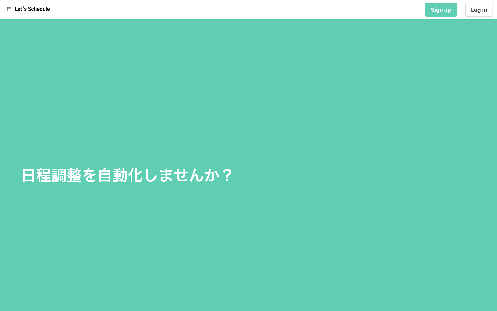

##### 新規作成ページ

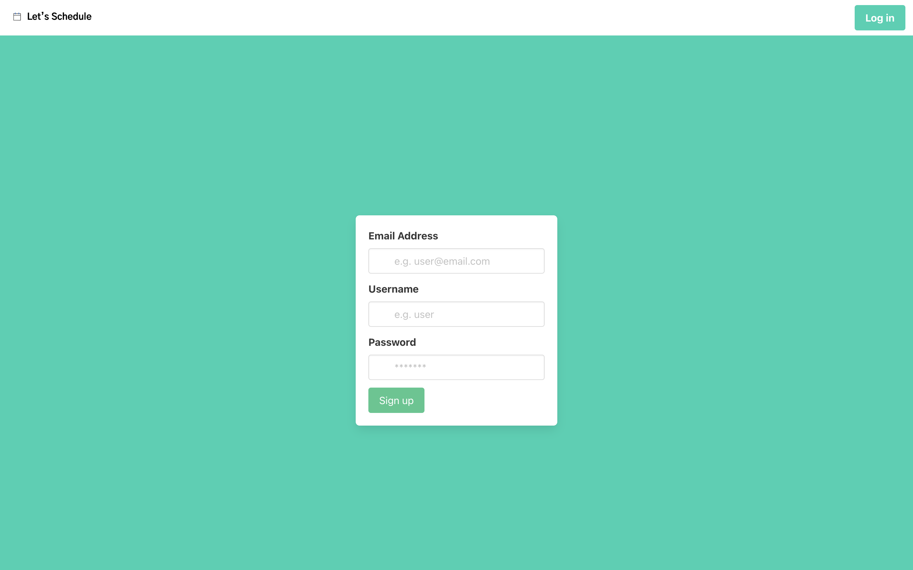

##### ログインページ

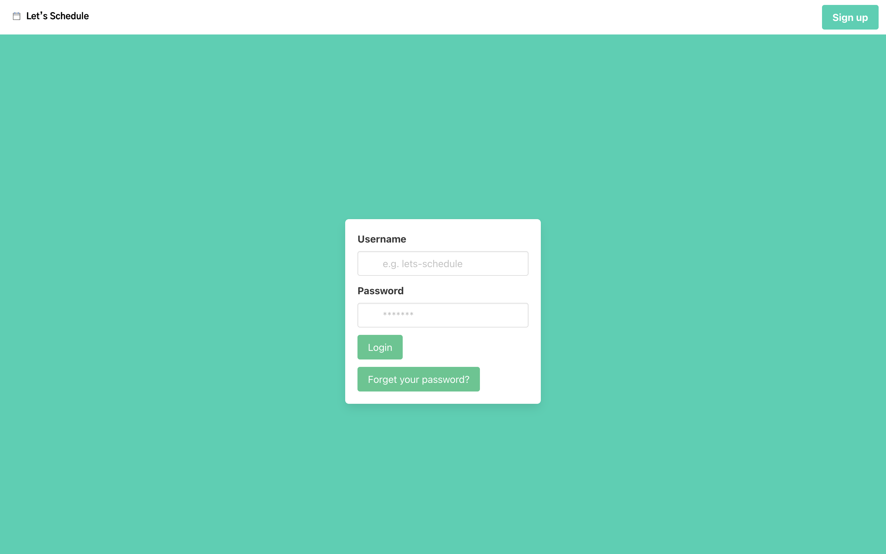

##### ミーティング新規作成ページ

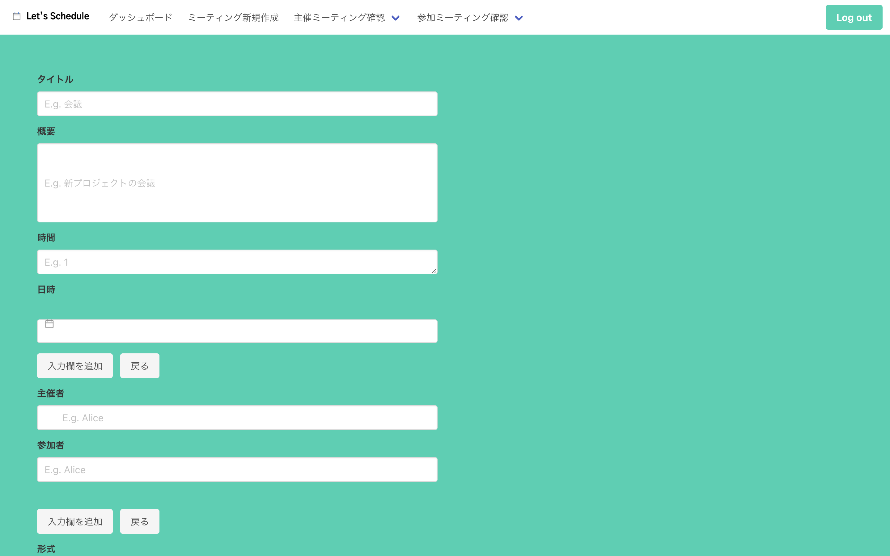

##### 主催・参加ミーティング一覧ページ (日程確定)

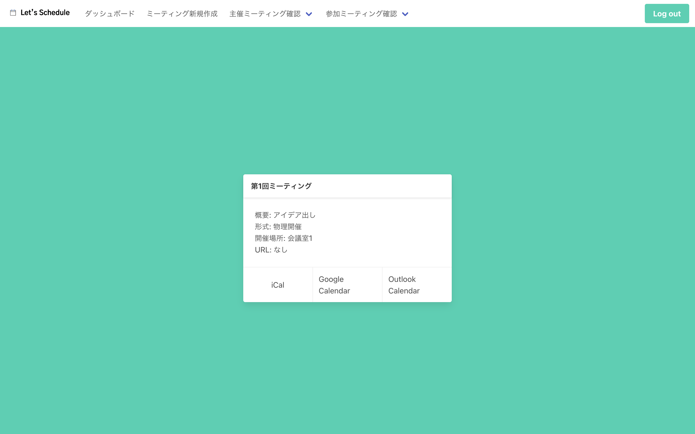

##### 主催・参加ミーティング一覧ページ (日程未確定)

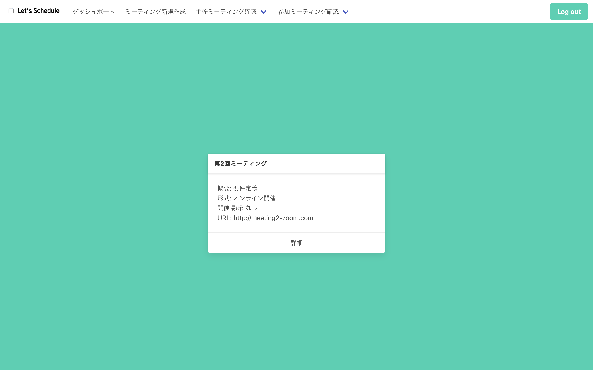

##### 参加ミーティング一覧ページ (未返信)


##### ミーティング時間決定ページ 

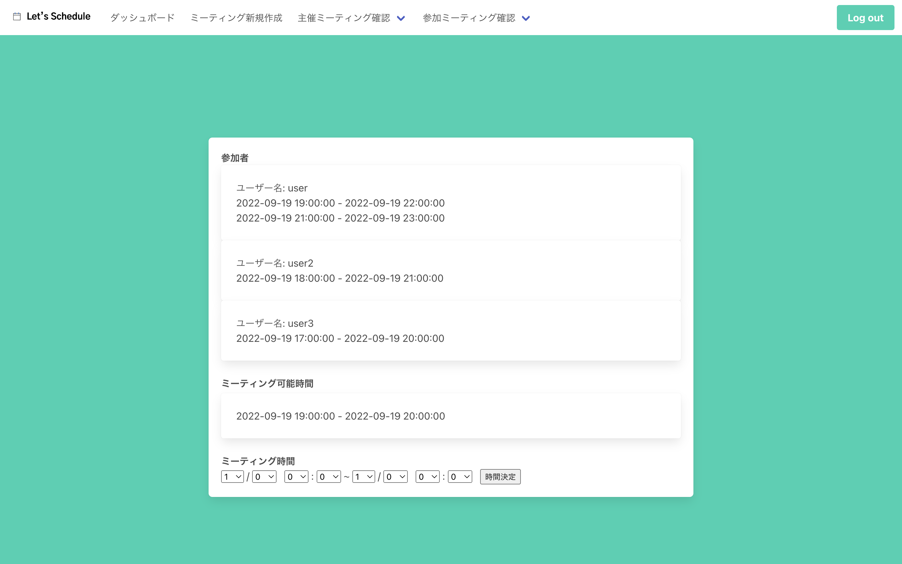

##### ミーティング候補時間決定ページ

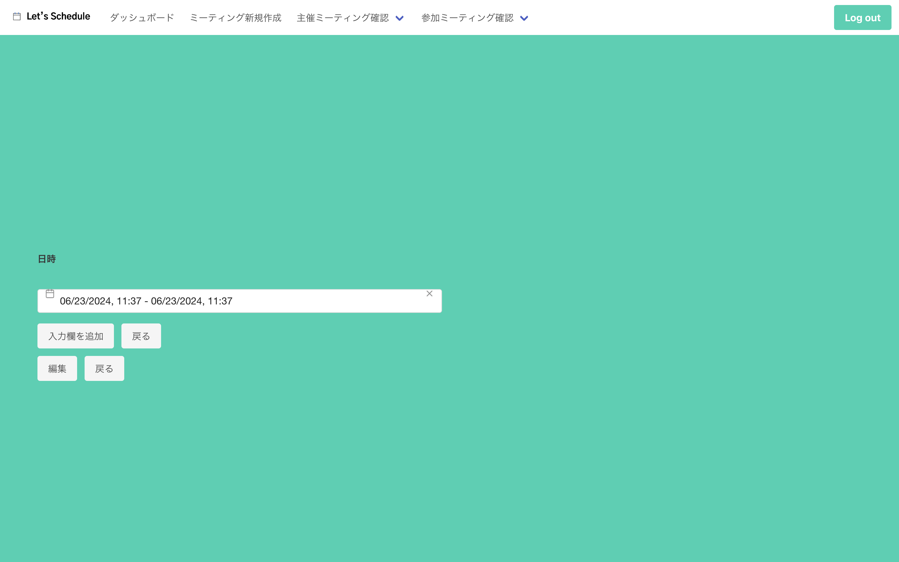

#### ページ遷移図

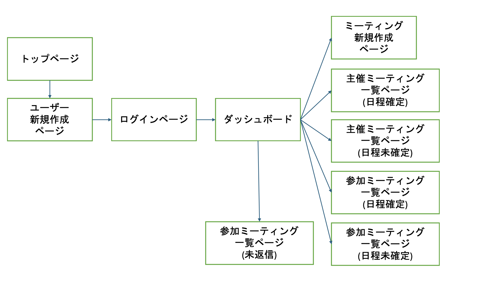
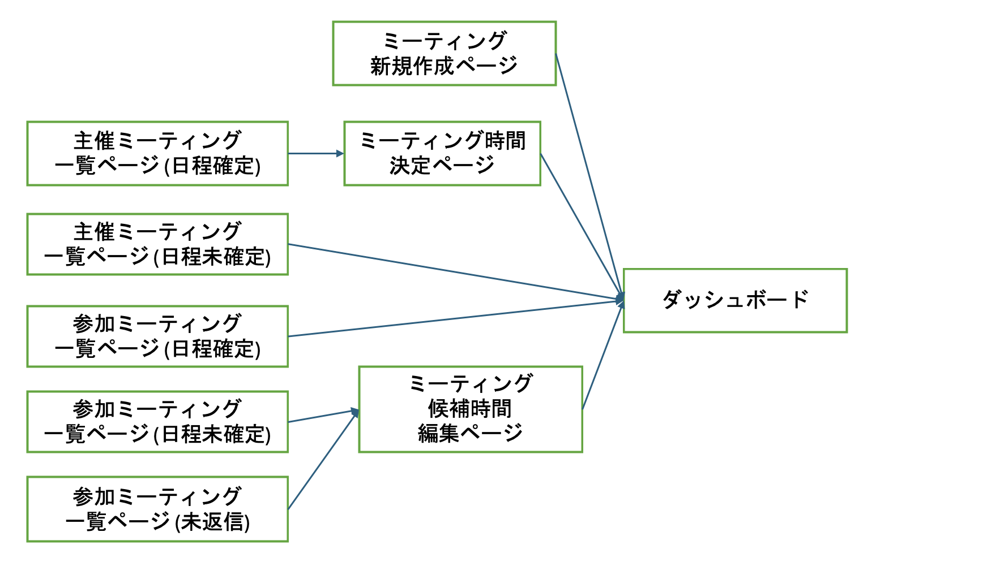

### バックエンド

#### オブジェクト定義

##### Userオブジェクト

| 変数名 | 型 | 説明 | 
| ---- | ---- | ---- |
| id | int | ユーザーID |
| user_name | string |  ユーザー名 | 
| email_address | string | メールアドレス | 
| password | string | パスワード | 
| is_admin | bool | 管理者かどうか | 
| can_login | bool | ログイン可能か | 
| created_at | datetime | 登録日時 | 
| updated_at | datetime | 更新日時 | 

##### Meetingオブジェクト

| 変数名 | 型 | 説明 | 
| ---- | ---- | ---- |
| id | int | ミーティングID | 
| title | string | ミーティング名 | 
| description | text | 概要 | 
| is_onsite | bool | オンサイト開催か (falseの場合はオンライン開催) | 
| place | string | 集合場所 | 
| url | string | ミーティングURL | 
| all_participants_responded | bool | 全員が回答したか | 
| is_confirmed | bool | 確定したか | 
| start_time | datetime | 開始日時 | 
| end_time | datetime | 終了日時 | 
| created_at | datetime | 登録日時 | 
| updated_at | datetime | 更新日時 | 

##### CandidateTimeオブジェクト

| 変数名 | 型 | 説明 | 
| ---- | ---- | ---- |
| id  | int | ID | 
| user_id | int | ユーザーID | 
| meeting_id | int | ミーティングID |
| start_time | datetime | 開始時間 | 
| end_time | datetime | 終了時間 | 
| created_at | datetime | 登録日時 | 
| updated_at | datetime | 更新日時 | 

##### Participantオブジェクト

| 変数名 | 型 | 説明 | 
| ---- | ---- | ---- |
| id  | int | ID | 
| user_id | int | ユーザーID | 
| meeting_id | int | ミーティングID |
| is_host | bool | 主催者かどうか | 
| has_responded | bool | 回答の有無 | 
| created_at | datetime | 登録日時 | 
| updated_at | datetime | 更新日時 | 

#### API定義

##### 共通設定

各APIは次のフォーマットのURLとする

```
https://lets-schedule.net/<エンドポイントのパス>
```

通信プロトコル: HTTPS
APIの種類: REST API
インターフェース: JSON
文字コード: UTF-8

##### ユーザー関連API

###### 新規ユーザー作成

エンドポイント POST /YXBpL3NpZ251cA==

リクエストパラメータ

| キー名 | 型 (変数) | 概要 | 備考 |
| -- | -- | -- | -- | 
| id | int | ユーザーID | -- | 
| username | string | ユーザー名 | |
| email_address | string | メールアドレス | |
| password | string | パスワード | |
| is_admin | bool | 管理者かどうか | デフォルトはfalse |
| can_login | bool | ログイン可能かどうか | デフォルトはtrue |


ステータスコード

| コード | 意味 |
| -- | -- | 
| 200 | ユーザー登録成功 |
| 400 | ユーザー登録失敗 |

レスポンスパラメータ

| シチュエーション | キー名 | 型 | 概要 |
| -- | -- | -- | -- | 
| 成功時 | id | int | ユーザーID |
| | username | string | ユーザー名 |
| | email_address | string | メールアドレス |
| | password | string | パスワード |
| | is_admin | bool | 管理者かどうか |
| | can_login | bool | ログイン可能かどうか | 
| 失敗時 | errorMessageList | array\[string\] | エラーメッセージの配列 |

##### ミーティング関連API

###### ミーティング新規作成

エンドポイント POST /YXBpL3Jlc3RyaWN0ZWQvbWVldGluZ3MvbmV3

パラメータ

| キー名 | 型 (変数) | 概要 | 
| -- | -- | -- |
| title | string | ミーティング名 |
| description | text | 概要 |
| type | string | 形式 |
| place | string | 集合場所 |
| url | string | ミーティングURL |
| is_confirmed | bool | 日時が決定したかどうか |


ステータスコード

| コード | 意味 |
| -- | -- |
| 200 | ミーティング登録成功 |
| 400 | ミーティング登録失敗 |


レスポンスパラメータ

| シチュエーション | キー名 | 型 | 概要 |
| -- | -- | -- | -- | 
| 成功時 | id | int | ユーザーID |
| | title | string | ミーティング名 |
| |  description | text | 概要 |
| |  type | string | 形式 |
| |  place | string | 集合場所 |
| |  url | string | ミーティングURL |
| |  is_confirmed | bool | 日時が決定したかどうか |
| 失敗時 | errorMessageList | array\[string\] | エラーメッセージの配列 |


###### ミーティング情報取得

エンドポイント GET /YXBpL3Jlc3RyaWN0ZWQvbWVldGluZ3MvdXNlcg==/:user_id

パラメータ

| キー名 | 型 (変数) | 概要 | 
| -- | -- | -- |
| user_id | string | ユーザーID |


ステータスコード

| コード | 意味 |
| -- | -- |
| 200 | ミーティング情報取得成功 |
| 400 | ミーティング情報取得失敗 |


レスポンスパラメータ

| シチュエーション | キー名 | 型 (変数) | 概要 | 
| -- | -- | -- | -- |
| 成功時 | id| string | ミーティングID |
| | title | string | ミーティング名 |
| | description | text | 概要 |
| | type | string | 形式 |
| | meeting_place | string | 集合場所 |
| | meeting_url | string | ミーティングURL |
| | all_participants_responded | bool | 全員から返信があったか |
| | is_confirmed | bool | 日時が決まったか |
| | start_time | datetime | ミーティングの開始日時 |
| | end_time | datetime | ミーティングの終了日時 |
| | hour | float | ミーティングの時間 (h) |
| 失敗時 | error | string | デフォルトは「エラーが発生しました」 |

###### 日時が決定した主催ミーティング情報取得

エンドポイント GET /YXBpL3Jlc3RyaWN0ZWQvbWVldGluZ3MvaG9zdC9jb25maXJtZWQ=/:user_id

パラメータ

| キー名 | 型 (変数) | 概要 | 
| -- | -- | -- |
| user_id | string | ユーザーID |


ステータスコード

| コード | 意味 |
| -- | -- |
| 200 | ミーティング情報取得成功 |
| 400 | ミーティング情報取得失敗 |


レスポンスパラメータ

| シチュエーション | キー名 | 型 (変数) | 概要 | 
| -- | -- | -- | -- |
| 成功時 | meetings | Meeting[] | ミーティング情報の配列 |
| 失敗時 | error | string | デフォルトは「エラーが発生しました」 |


###### 日時が決定していない主催ミーティング情報取得

エンドポイント GET /aYXBpL3Jlc3RyaWN0ZWQvbWVldGluZ3MvaG9zdC9ub3QtY29uZmlybWVk/:user_id

パラメータ

| キー名 | 型 (変数) | 概要 | 
| -- | -- | -- |
| user_id | string | ユーザーID |


ステータスコード

| コード | 意味 |
| -- | -- |
| 200 | ミーティング情報取得成功 |
| 400 | ミーティング情報取得失敗 |


レスポンスパラメータ

| シチュエーション | キー名 | 型 (変数) | 概要 | 
| -- | -- | -- | -- |
| 成功時 | meetings | Meeting[] | ミーティング情報の配列 |
| 失敗時 | error | string | デフォルトは"エラーが発生しました |


###### 返信していない主催ミーティング情報取得

エンドポイント GET /YXBpL3Jlc3RyaWN0ZWQvbWVldGluZ3MvaG9zdC9ub3QtcmVzcG9uZGVk/:user_id

パラメータ

| キー名 | 型 (変数) | 概要 | 
| -- | -- | -- |
| user_id | string | ユーザーID |


ステータスコード

| コード | 意味 |
| -- | -- |
| 200 | ミーティング情報取得成功 |
| 400 | ミーティング情報取得失敗 |


レスポンスパラメータ

| シチュエーション | キー名 | 型 (変数) | 概要 | 
| -- | -- | -- | -- |
| 成功時 | meetings | Meeting[] | ミーティング情報の配列 |
| 失敗時 | error | string | デフォルトは「エラーが発生しました」 |


###### 日時が決定している参加ミーティング情報取得

エンドポイント GET /YXBpL3Jlc3RyaWN0ZWQvbWVldGluZ3MvZ3Vlc3QvY29uZmlybWVk/:user_id

パラメータ

| キー名 | 型 (変数) | 概要 | 
| -- | -- | -- |
| user_id | string | ユーザーID |


ステータスコード

| コード | 意味 |
| -- | -- |
| 200 | ミーティング情報取得成功 |
| 400 | ミーティング情報取得失敗 |


レスポンスパラメータ

| シチュエーション | キー名 | 型 (変数) | 概要 | 
| -- | -- | -- | -- |
| 成功時 | meetings | Meeting[] | ミーティング情報の配列 |
| 失敗時 | error | string | デフォルトは「エラーが発生しました」 |


###### 日時が決定していない参加ミーティング情報取得

エンドポイント GET /YXBpL3Jlc3RyaWN0ZWQvbWVldGluZ3MvZ3Vlc3Qvbm90LWNvbmZpcm1lZA==/:user_id

パラメータ

| キー名 | 型 (変数) | 概要 | 
| -- | -- | -- |
| user_id | string | ユーザーID |


ステータスコード

| コード | 意味 |
| -- | -- |
| 200 | ミーティング情報取得成功 |
| 400 | ミーティング情報取得失敗 |


レスポンスパラメータ

| シチュエーション | キー名 | 型 (変数) | 概要 | 
| -- | -- | -- | -- |
| 成功時 | meetings | Meeting[] | ミーティング情報の配列 |
| 失敗時 | error | string | デフォルトは |


###### 返信していない参加ミーティング情報取得

エンドポイント GET /YXBpL3Jlc3RyaWN0ZWQvbWVldGluZ3MvZ3Vlc3Qvbm90LXJlc3BvbmRlZA===/:user_id

パラメータ

| キー名 | 型 (変数) | 概要 | 
| -- | -- | -- |
| user_id | string | ユーザーID |


ステータスコード

| コード | 意味 |
| -- | -- |
| 200 | ミーティング情報取得成功 |
| 400 | ミーティング情報取得失敗 |


レスポンスパラメータ

| シチュエーション | キー名 | 型 (変数) | 概要 | 
| -- | -- | -- | -- |
| 成功時 | meetings | Meeting[] | ミーティング情報の配列 |
| 失敗時 | error | string | デフォルトは「エラーが発生しました」 |

##### 候補日時関連API

###### 候補日時の新規登録

エンドポイントPOST /YXBpL3Jlc3RyaWN0ZWQvY2FuZGlkYXRlX3RpbWVzL25ldw==

リクエストパラメータ

| キー名 | 型 (変数) | 概要 |
| -- | -- | -- |
| candidate_time_list | CandidateTime[] | 候補日時の配列 |


レスポンスパラメータ

| シチュエーション | キー名 | 型 (変数) | 概要 | 
| -- | -- | -- | -- |
| 成功時 | candidate_time | CandidateTime[] | 候補日時の配列 |
| 失敗時 | error | string | デフォルトは「エラーが発生しました」 |


###### 候補日時の取得

エンドポイント GET /YXBpL3Jlc3RyaWN0ZWQvY2FuZGlkYXRlX3RpbWVzL3VzZXI=/:user_id/bWVldGluZw==/:meeting_id

リクエストパラメータ

| キー名 | 型 (変数) | 概要 |
| -- | -- | -- |
| user_id | int | ユーザーID |
| meeting_id | int | ミーティングID |


レスポンスパラメータ

| シチュエーション | キー名 | 型 (変数) | 概要 | 
| -- | -- | -- | -- |
| 成功時 | candidate_time | CandidateTime | 候補日時の配列 |
| 失敗時 | error | string | デフォルトは「エラーが発生しました」 |


###### 候補日時の編集

エンドポイント PUT /YXBpL3Jlc3RyaWN0ZWQvY2FuZGlkYXRlX3RpbWVzL3VzZXI=/:user_id/bWVldGluZw==/:meeting_id

リクエストパラメータ

| キー名 | 型 (変数) | 概要 |
| -- | -- | -- |
| user_id | int | ユーザーID |
| meeting_id | int | ミーティングID |


レスポンスパラメータ

| シチュエーション | キー名 | 型 (変数) | 概要 | 
| -- | -- | -- | -- |
| 成功時 | candidate_time | CandidateTime[] | 候補日時の配列 |
| 失敗時 | error | string | デフォルトは「エラーが発生しました」 |


##### 参加者関連API 

###### 参加者の新規登録

エンドポイントPOST /YXBpL3Jlc3RyaWN0ZWQvcGFydGljaXBhbnRzL25ldw==

リクエストパラメータ

| キー名 | 型 (変数) | 概要 |
| -- | -- | -- |
| participants | Participant[] | 候補日時の配列 |


レスポンスパラメータ

| シチュエーション | キー名 | 型 (変数) | 概要 | 
| -- | -- | -- | -- |
| 成功時 | participants | Participant[] | 候補日時の配列 |
| 失敗時 | error | string | デフォルトは「エラーが発生しました」 |


###### 参加者の取得

エンドポイント GET /YXBpL3Jlc3RyaWN0ZWQvcGFydGljaXBhbnRz/:meeting_id

リクエストパラメータ

| キー名 | 型 (変数) | 概要 |
| -- | -- | -- |
| meeting_id | int | ミーティングID |


レスポンスパラメータ

| シチュエーション | キー名 | 型 (変数) | 概要 | 
| -- | -- | -- | -- |
| 成功時 | participants | Participant[] | 候補日時の配列 |
| 失敗時 | error | string | デフォルトは「エラーが発生しました」 |

###### 参加者の編集

エンドポイント PUT /YXBpL3Jlc3RyaWN0ZWQvcGFydGljaXBhbnRzL21lZXRpbmc=/:meeting_id

リクエストパラメータ

| キー名 | 型 (変数) | 概要 |
| -- | -- | -- |
| meeting_id | int | ミーティングID |


レスポンスパラメータ

| シチュエーション | キー名 | 型 (変数) | 概要 | 
| -- | -- | -- | -- |
| 成功時 | participants | Participant[] | 参加者の配列 |
| 失敗時 | error | string | デフォルトは「エラーが発生しました」 |


### DB

#### 前提

- 文字コードはUTF-8を用いる
- タイムゾーンはAsia/Tokyoを用いる
- sys.columnsは使用しない

#### Usersテーブル

| 項目名 (日本語) | 項目名 (変数) | 型 | NULL許容か | 備考 | 
| ---- | ---- | ---- | ---- | ---- |
| ID | id | bigint unsigned(11) | False | primary key auto increment |
| ユーザー名 | user_name | varchar(191) | False | |
| メールアドレス | email_address | varchar(191) | False | |
| パスワード | password | varchar(191) | False | |
| 管理者かどうか | is_admin | boolean | False | |
| ログイン可能か | can_login | boolean | False | |
| 登録日時 | created_at | datetime | False | default current_datetime |
| 更新日時 | updated_at | datetime | False | default current_datetime on update current_datetime | 

#### Meetingsテーブル

| 項目名 (日本語) | 項目名 (変数) | 型 | NULL許容か | 備考 | 
| ---- | ---- | ---- | ---- | ---- |
| ID | id | bigint unsigned(11) | False | primary key auto increment |
| ミーティング名 | title | varchar(191) | False | |
| 概要 | description | text | False | |
| 物理開催かどうか | is_onsite | boolean | False | |
| 集合場所 | place | varchar(191) | False | |
| ミーティングURL | url | varchar(191) | False | |
| 全員が回答したか | all_participants_responded | boolean | False | |
| 確定したか | is_confirmed | boolean | False | |
| 開始日時 | start_time | datetime | False | |
| 終了日時 | end_time | datetime | False | |
| ミーティング時間(分) | minutes | int | False | |
| 登録日時 | created_at | datetime | False | default current_datetime |
| 更新日時 | updated_at | datetime | False | default current_datetime on update current_datetime |

#### Participantテーブル

| 項目名 (日本語) | 項目名 (変数) | 型 | NULL許容か | 備考 | 
| ---- | ---- | ---- | ---- | ---- |
| ID | id  | bigint unsigned(11) | False | primary key auto increment |
| ユーザーID | user_id | bigint unsigned(11) | False | | 
| ミーティングID | meeting_id | bigint unsigned(11) | False | |
| 主催者かどうか | is_host | boolean | False | |
| 回答の有無 | has_responded | boolean | False | |
| 登録日時 | created_at | datetime | False | default current_datetime |
| 更新日時 | updated_at | datetime | False | default current_datetime on update current_datetime |

#### CandidateTimeテーブル

| 項目名 (日本語) | 項目名 (変数) | 型 | NULL許容か | 備考 | 
| ---- | ---- | ---- | ---- | ---- |
| ID | id  | bigint unsigned(11) | False | primary key auto increment |
| ユーザーID | user_id | bigint unsigned(11) | False | |
| ミーティングID | meeting_id | bigint unsigned(11) | False | |
| 開始時間 | start_time | datetime | False | |
| 終了時間 | end_time | datetime | False | |
| 登録日時 | created_at | datetime | False | default current_datetime |
| 更新日時 | updated_at | datetime | False | default current_datetime on update current_datetime |

#### キー一覧

##### Usersテーブル

| 種類 | キー名 | 備考 |
| ---- | ---- | ---- |
| プライマリーキー | id | |

##### Meetingsテーブル

| 種類 | キー名 | 備考 |
| ---- | ---- | ---- |
| プライマリーキー | id | |

##### Participantテーブル

| 種類 | キー名 | 備考 |
| ---- | ---- | ---- |
| プライマリーキー | id | |
| 外部キー | meeting_id | REFERENCES meeting(meeting_id) |

##### CandidateTimeテーブル

| 種類 | キー名 | 備考 |
| ---- | ---- | ---- |
| プライマリーキー | id | |
| 外部キー | user_id | REFERENCES user(user_id) |
| | meeting_id | REFERENCES meeting(meeting_id) |


## 非機能要件

### 可用性

#### SLA

今回は２台のEC2インスタンスの冗長構成を採用した。

インスタンス1台のSLAが99.5%であることから、サービスのSLAは

```
1 - (1 - 0.995)**2 = 0.999975
```

よって、SLAは99.9%は担保される。

### パフォーマンス

#### 同時接続数

同時接続数は250とする。

なお、根拠は以下の通りである。

研究室のメンバー (教員・学生含め) 112人 
合唱団のメンバー 38人
日常的に連絡を取っている友人 10人 
友人が参加する集まりの参加者数 10人程度

合計 112 + 38 + 10 * 10 = 250 

### セキュリティ

#### 証明書

WebサーバーとAPIサーバーには両方ともLet's Encryptのcertbotで取得した証明書を使用する。
なお、この場合の暗号化アルゴリズムはP-384のECDSAとする。

#### アクセス制御

##### アルゴリズム選定

ユーザー認証に使用するアルゴリズムを決定する際にBasic認証、JWT認証、OAuthの3つを比較して、JWT認証を採用する。
一時的な認証情報が提供できることと、使用するメールアドレスに制限がないことが選定理由である。

|  | Basic | JWT | OAuth | 
| ---- | ---- | ---- | ---- |
| 認証情報 | ユーザー名とパスワード | アクセストークン | アクセストークン |
| 有効期限 | 永続 | (有効期限を設定すれば)一時的 | 一時的 |
| 使用できるメールアドレス | 制限なし | 制限なし | 限定 |

##### 認証

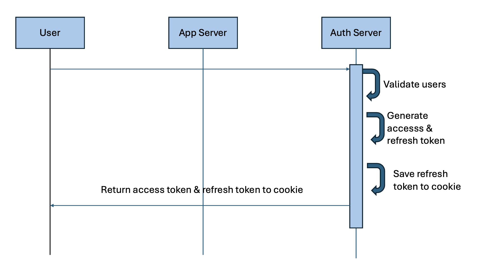

##### 認可


### 可観測性

#### ホストVM

- アクセスログ: nginxのHTTPリクエストログ
- エラーログ: nginxのエラーログ
- アップストリームログ: webサーバーへのリダイレクトログ
- レスポンスログ: nginxのHTTPレスポンスログ

#### Webサーバー

- アクセスログ: nginxのアクセスログ
- エラーログ: nginxのエラーログ

#### APIサーバー

- アクセスログ: HTTPリクエストのログ
- レスポンスログ: HTTPレスポンスのログ
- クエリログ: DBで発行したクエリのログ

#### DBサーバー

- アクセスログ: DBサーバーのアクセスログ

### 保守性

#### インフラ構成図

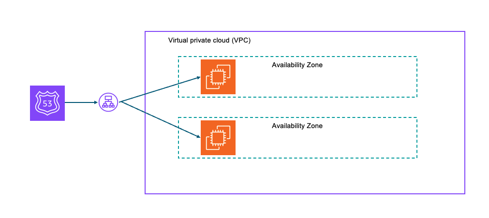

#### ネットワーク構成

- VPC 20.0.0.0/16 (ap-northeast-1)
    - subnet1 20.0.1.0/24 (ap-northeast-1a)
    - subnet2 20.0.2.0/24 (ap-northeast-1b)

#### セキュリティグループ

##### インバウンドルール

| プロトコル | ポート範囲 | ソース | 説明 | 
| ---- | ---- | ---- | ---- |
| TCP | 8443 | 0.0.0.0/0 | カスタムHTTPSポート (公開アクセス)|

##### アウトバウンドルール

| プロトコル | ポート範囲 | ソース | 説明 | 
| ---- | ---- | ---- | ---- |
| All | All | 0.0.0.0/0 | |


## 使用技術

### フロントエンド

開発者が実務での使用経験のあるReact, Vue3のComposition API、Vue3のOption APIの中でVue3のOption APIを選定した。
選定基準は学習コストの低さと可読性の高さの2つで、両方を満たす点が選定理由である。


|  | React | Vue3 (Composition API) | Vue3 (Option API) | 
| ---- | ---- | ---- | ---- |
| 学習コスト | 高 | 中 | 低 |
| 可読性 | 低 | 中 | 高 |


### バックエンド

開発者が実務での使用経験のあるPython、Ruby、Golangの中でGolangを選定した。
選定基準は可読性の高さと静的型付けであるかの2つで、両方を満たす点が選定理由である。

|  | Python | Ruby | Golang | 
| ---- | ---- | ---- | ---- |
| 可読性 | 高 | 高 | 高 |
| 静的型付けかどうか | x | x | ◯ |


### DB

|  | MySQL | MariaDB | PostgreSQL | 
| ---- | ---- | ---- | ---- |
| 可読性 | 高 | 高 | 高 |
| ARM64対応 | 動的 | 動的 | 静的 |


### インフラ

<!-- LambdaやECS・EKSなどのマネージドサービスとは違い、EC2インスタンスはVPC（Virtual Private Cloud）内で動作するため、ネットワーキングとセキュリティを細かく設定できる点が挙げられる。 -->

## 参考文献

Amazon Compute Service Level Agreement - Amazon AWS
https://aws.amazon.com/compute/sla/

https://dekh.medium.com/the-complete-guide-to-json-web-tokens-jwt-and-token-based-authentication-32501cb5125c
